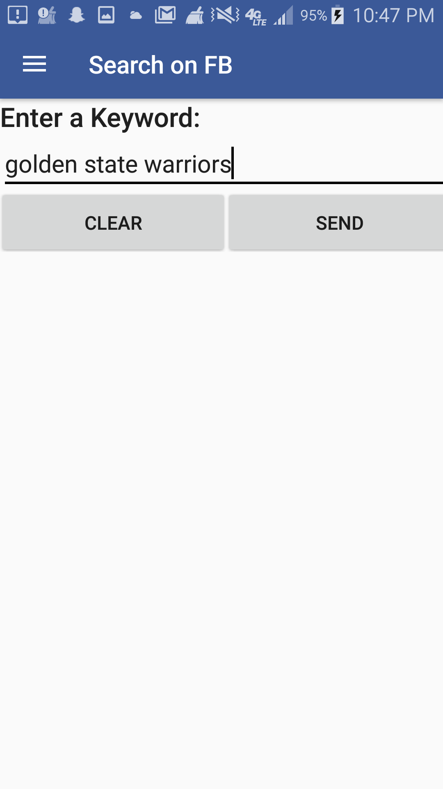
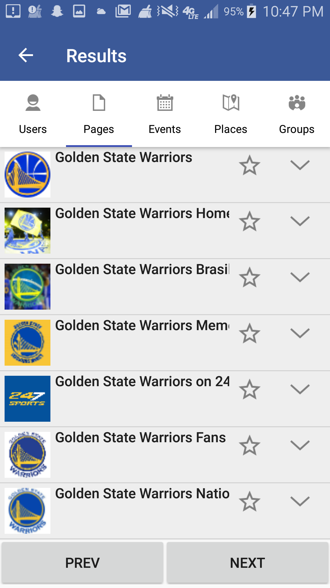
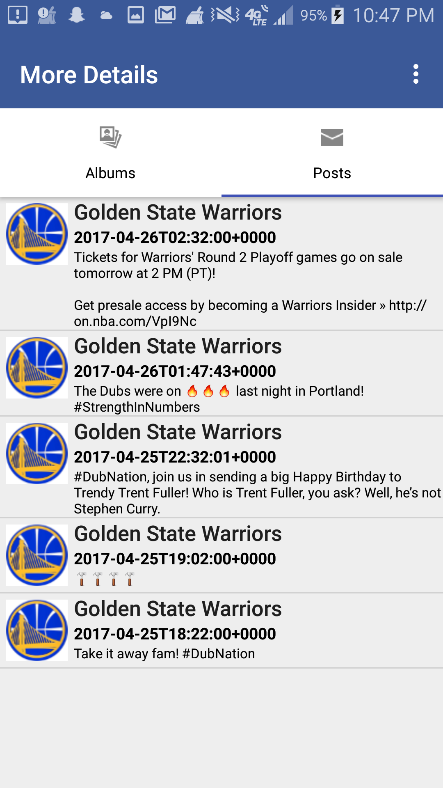
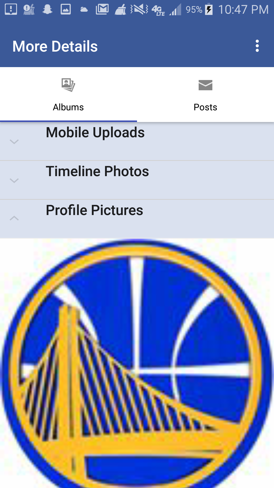

# Responsive Facebook Search (Android Application)
This is a mobile application to retrieve a user’s search data from Facebook API and display the search results in a mobile application. Queries can be submitted for users, pages, groups, events and places. The PHP script returns a JSON formatted data stream to the client, which is parsed and rendered to the app UI.

The app begins with a MainActivity page where a user can submit a search query. The resulting display is a tab menu and Activity display for the different types of queries (users, pages, groups, events, and places). Individual search results are displayed in rows of ListView and ImageView. An option for pagination is included to cap the search to 10 search results. An individual search result can then be clicked further to display another Activity page with the albums and photos for that particular search result.

When a search query is submitted, the data is loaded using the AJAX component of AngularJS, which calls a PHP backend hosted on AWS. The PHP script sends a server request to the Facebook back-end, which returns a JSON response. The JSON response gets passed to the client to display the results.

There is also an option to store favorites, which are held globally in the app using a Singleton. Favorites are marked with an ImageView of a filled star icon.

Additionally, a hamburger menu option is present to access the MainActivity (Home Page), FavoritesActivity page, and the AboutActibity (About Me) pages.

## Application Flow

